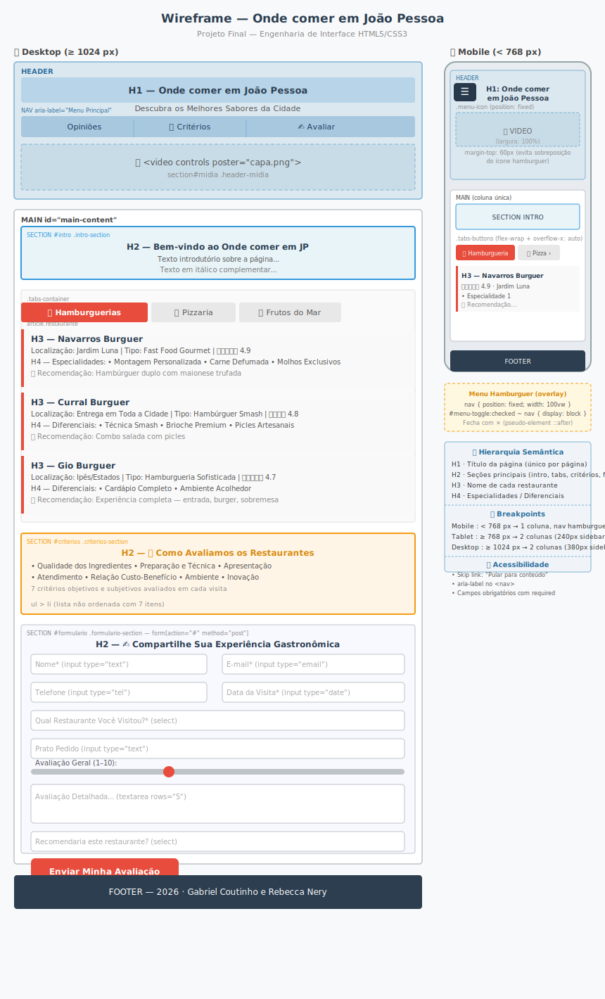

# Onde comer em João Pessoa — Guia Gastronômico

## Definição do Problema

### Contexto
Este projeto é um guia gastronômico colaborativo dedicado a João Pessoa - PB. O domínio é uma landing page de avaliações de restaurantes, focada em compartilhar experiências culinárias autênticas dos estabelecimentos mais populares da cidade. O site organiza as avaliações em categorias (hamburguerias, pizzarias, frutos do mar) e oferece um formulário para que visitantes registrem suas próprias opiniões.

### Público-alvo
- **Faixa etária:** 18–45 anos
- **Contexto de uso:** Planejamento de refeições, descoberta de novos restaurantes e compartilhamento de experiências gastronômicas
- **Dispositivo principal:** Smartphone — acesso predominantemente mobile, especialmente turistas em deslocamento pela cidade

### Dor Principal
O usuário não consegue encontrar, de forma centralizada e confiável, avaliações honestas de restaurantes locais em João Pessoa. As plataformas genéricas disponíveis não refletem a identidade gastronômica nordestina nem permitem filtrar por tipo de culinária de forma visual e intuitiva.

### Critério de Sucesso
O usuário consegue identificar um restaurante de sua preferência gastronômica, visualizar avaliação e prato recomendado, e submeter sua própria avaliação — tudo em menos de 60 segundos, sem erros de validação no formulário.

---

## Paleta de Cores

**Nome:** Sabor Nordestino
**Inspiração:** O vermelho evoca apetite e a gastronomia vibrante nordestina; o azul-acinzentado remete à serenidade das praias de João Pessoa.

| Token CSS | Hex | Uso |
|---|---|---|
| `--color-primary` | `#e74c3c` | Botões, destaques, bordas de cartões |
| `--color-primary-dark` | `#c0392b` | Hover de botões, links ativos |
| `--color-text-primary` | `#2c3e50` | Texto principal, títulos |
| `--color-text-secondary` | `#34495e` | Subtítulos, texto de suporte |
| `--color-bg-primary` | `#f5f7fa` | Fundo principal da página |
| `--color-bg-secondary` | `#c3cfe2` | Gradiente do fundo |
| `--color-border` | `#bdc3c7` | Bordas de inputs e separadores |
| `--color-success` | `#27ae60` | Confirmações, estados de sucesso |
| `--color-warning` | `#f39c12` | Seção de critérios, alertas |

**Contraste verificado (WCAG):**
- `#2c3e50` sobre `#f5f7fa` → ratio ≈ 10.4:1 ✅ **AAA**
- `#ffffff` sobre `#e74c3c` → ratio ≈ 4.6:1 ✅ **AA**
- `#d68910` sobre `#fff5e6` → ratio ≈ 4.5:1 ✅ **AA**

---

## Wireframe



---

## Estrutura CSS (ITCSS)

```
app_principal/css/
├── settings/variables.css   ← Custom Properties: cores (9), tipografia (escala completa), espaçamento, bordas, sombras
├── tools/tools.css           ← Placeholder ITCSS (mixins/funções em pré-processadores)
├── base/reset.css            ← Modern CSS Reset + estilos base de elementos (body, h1-h2, img, a)
├── layout/layout.css         ← Estrutura de página: header, main, footer, grid responsivo (768/1024 px)
├── components/components.css ← Nav, menu hamburguer, tabs, cards de restaurante, seções, formulário, modo escuro
└── utilities/utilities.css   ← hr, .cards-grid, #valor-avaliacao, prefers-reduced-motion
```

---

## Tecnologias

- HTML5 semântico (header, main, footer, section, article, nav, form)
- CSS3 — ITCSS, Custom Properties, Flexbox, CSS Grid, Media Queries, `clamp()`
- JavaScript vanilla (slider de avaliação, sistema de abas, validação de formulário)
- Google Fonts — Inter (400, 500, 600, 700)

---

*2026 — Gabriel Coutinho e Rebecca Nery*
