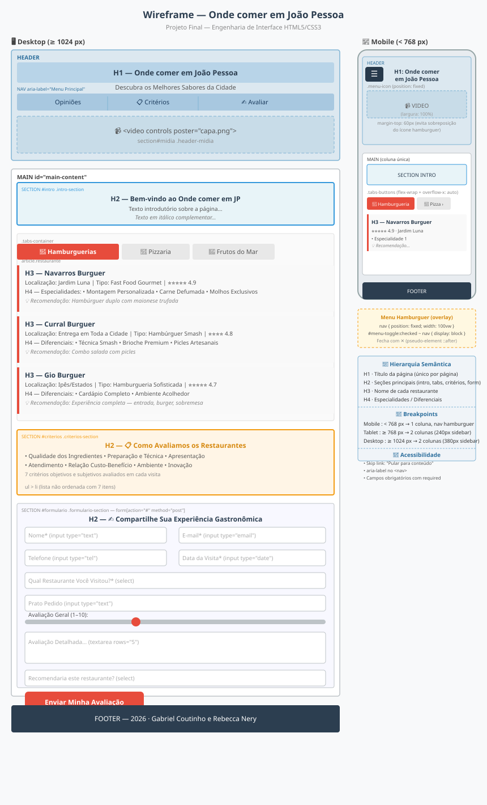

# Onde comer em João Pessoa — Guia Gastronômico

## Definição do Problema

### Contexto
Este projeto é um guia gastronômico colaborativo dedicado a João Pessoa - PB. O domínio é uma landing page de avaliações de restaurantes, focada em compartilhar experiências culinárias autênticas dos estabelecimentos mais populares da cidade. O site organiza as avaliações em categorias (hamburguerias, pizzarias, frutos do mar) e oferece um formulário para que visitantes registrem suas próprias opiniões.

### Público-alvo
- **Faixa etária:** 18–45 anos
- **Contexto de uso:** Planejamento de refeições, descoberta de novos restaurantes e compartilhamento de experiências gastronômicas
- **Dispositivo principal:** Smartphone — acesso predominantemente mobile, especialmente turistas em deslocamento pela cidade

### Dor Principal
O usuário não consegue encontrar, de forma centralizada e confiável, avaliações honestas de restaurantes locais em João Pessoa. As plataformas genéricas disponíveis não refletem a identidade gastronômica nordestina nem permitem filtrar por tipo de culinária de forma visual e intuitiva.

### Critério de Sucesso
O usuário consegue identificar um restaurante de sua preferência gastronômica, visualizar avaliação e prato recomendado, e submeter sua própria avaliação — tudo em menos de 60 segundos, sem erros de validação no formulário.

---

## Paleta de Cores

**Nome:** Verde Esmeralda + Creme
**Inspiração:** O verde-floresta evoca a natureza e a frescura da gastronomia; o creme sage remete à leveza da culinária nordestina litorânea.

| Token semântico | Hex | Uso |
|---|---|---|
| `--color-action-primary` | `#1B7A4A` | Botões, bordas de cartões, abas ativas |
| `--color-action-primary-hover` | `#155C37` | Hover de botões e links |
| `--color-text-primary` | `#1B4332` | Texto principal, header |
| `--color-text-secondary` | `#2D6A4F` | Subtítulos, texto de suporte |
| `--color-text-muted` | `#4A5E48` | Placeholders, texto auxiliar |
| `--color-bg-body-start` | `#EDF4ED` | Início do gradiente de fundo |
| `--color-bg-body-end` | `#CCDECE` | Fim do gradiente de fundo |
| `--color-border-default` | `#A4B8A4` | Bordas de inputs e separadores |
| `--color-warning` | `#A89040` | Borda da seção de critérios |
| `--color-warning-dark` | `#7A6420` | Título da seção de critérios |

**Contraste verificado (WCAG):**
- `#1B4332` sobre `#EDF4ED` → ratio ≈ 8.8:1 ✅ **AAA**
- `#ffffff` sobre `#1B7A4A` → ratio ≈ 4.9:1 ✅ **AA**
- `#7A6420` sobre `#FDF5E0` → ratio ≈ 5.0:1 ✅ **AA**

---

## Wireframe



---

## Estrutura CSS (Design Token Architecture)

Arquitetura em camadas: primitivos → semânticos → componentes. Componentes nunca referenciam valores brutos diretamente.

```
app_principal/css/
├── main.css                  ← Entry point — importa todos os arquivos na ordem correta
├── tokens/
│   ├── primitives.css        ← Paleta bruta: todas as cores, nunca usadas diretamente nos componentes
│   ├── semantic.css          ← Tokens de intenção (--color-action-primary, --color-bg-card…) + dark mode
│   ├── spacing.css           ← Grid de 4pt, border-radius, sombras
│   └── typography.css        ← Escala fluida com clamp(), pesos, line-heights
├── base/
│   ├── reset.css             ← Modern CSS Reset + estilos base de elementos
│   └── global.css            ← Estrutura de página, seções, sistema de abas, dark mode
├── components/
│   ├── navbar.css            ← Navegação principal
│   ├── hamburguer.css        ← Menu hamburguer mobile
│   ├── tabs.css              ← Sistema de abas por categoria
│   ├── card.css              ← Cards de restaurante
│   ├── form.css              ← Formulário, inputs, placeholders, botões
│   └── footer.css            ← Rodapé
└── utilities.css             ← Classes utilitárias, skip link, prefers-reduced-motion
```

---

## Tecnologias

- HTML5 semântico (header, main, footer, section, article, nav, form)
- CSS3 — ITCSS, Custom Properties, Flexbox, CSS Grid, Media Queries, `clamp()`
- JavaScript vanilla (slider de avaliação, sistema de abas, validação de formulário)
- Google Fonts — Inter (400, 500, 600, 700)

---

*2026 — Gabriel Coutinho e Rebecca Nery*
